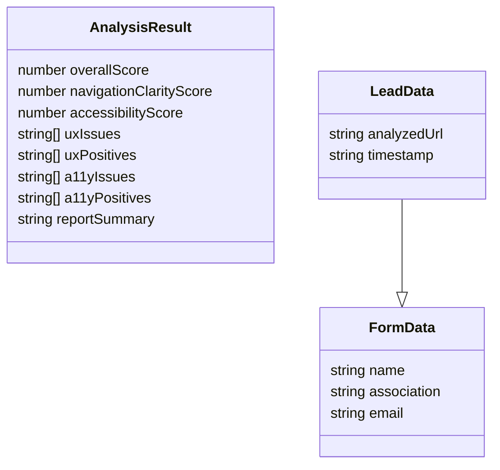
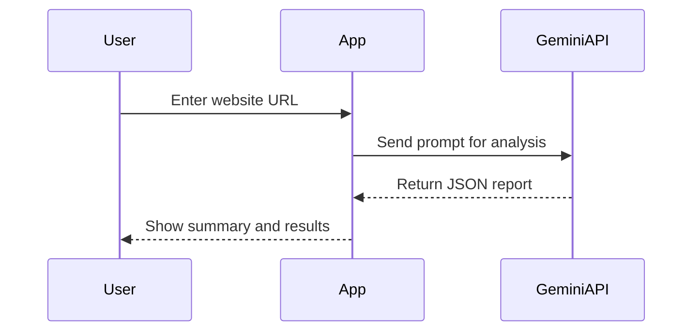
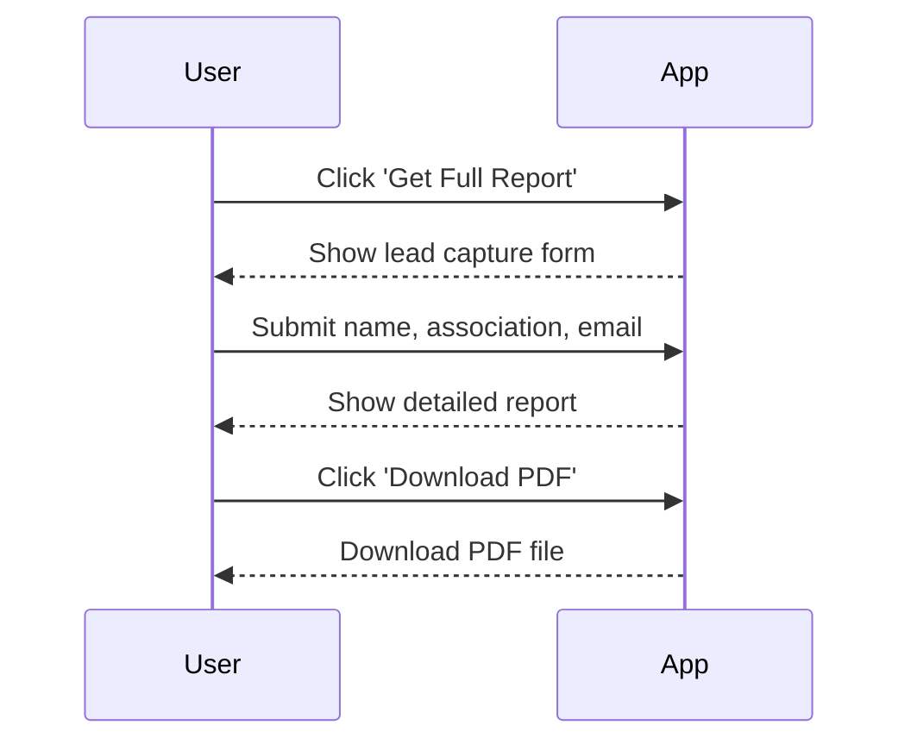
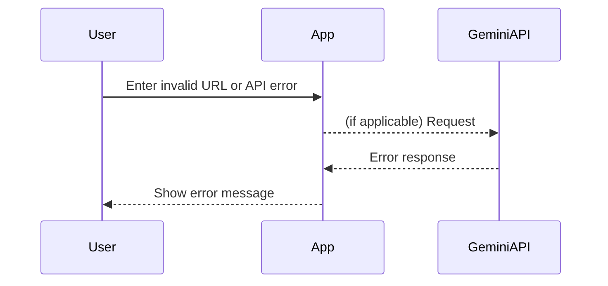
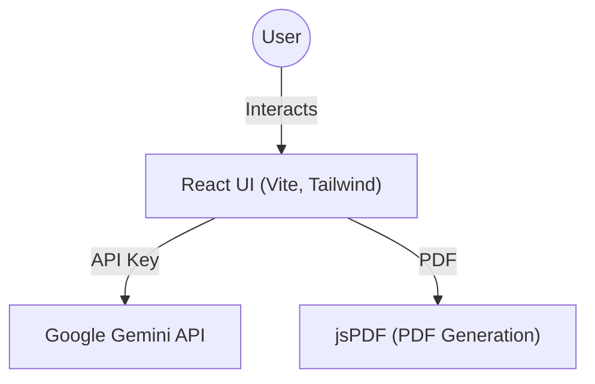

# NavSense AI™ Architectural Overview

## High-Level Application Overview
NavSense AI™ is a web-based application designed to provide national associations with actionable assessments of their website's navigation clarity (UX) and accessibility (AODA compliance). The tool acts as a lead magnet for UX/accessibility retainer services, offering instant analysis and a downloadable report.

---

## Main Components

### 1. Frontend
- **Framework:** React (TypeScript)
- **Build Tool:** Vite
- **UI Libraries:** Tailwind CSS (via CDN)
- **PDF Generation:** jsPDF
- **Key Features:**
  - Website URL intake and validation
  - Loading and error states
  - Results summary and detailed report views
  - Lead capture form
  - PDF report download

### 2. Backend
- **Type:** None (all logic is client-side)
- **AI Integration:** Calls Google Generative Language API (Gemini) directly from the frontend using an API key.

### 3. Database
- **Type:** None (no persistent storage in current implementation)
- **Note:** Lead data is not stored or sent to a backend; all data is handled in-memory on the client.

### 4. External Integrations
- **Google Generative Language API (Gemini):** Used for generating simulated analysis reports.
- **jsPDF:** Used for generating downloadable PDF reports on the client.

---

## Key Data Models

### AnalysisResult
- `overallScore: number`
- `navigationClarityScore: number`
- `accessibilityScore: number`
- `uxIssues: string[]`
- `uxPositives: string[]`
- `a11yIssues: string[]`
- `a11yPositives: string[]`
- `reportSummary: string`

### FormData
- `name: string`
- `association: string`
- `email: string`

### LeadData (extends FormData)
- `analyzedUrl: string`
- `timestamp: string`

---

## Authentication/Authorization Flow
- **Current State:**
  - No authentication or authorization is implemented.
  - All features are public and accessible to any user with the app open.
  - API key for Google Gemini is stored in a `.env` file and injected at build time.

---

## Core Workflows

### 1. Website Analysis (Client Intake)

### 2. Lead Capture & Full Report

### 3. Error Handling

---

## Tech Stack

| Layer      | Technology         |
|------------|-------------------|
| Frontend   | React, TypeScript, Vite, Tailwind CSS, jsPDF |
| Backend    | None (API calls from frontend) |
| Database   | None              |
| AI Service | Google Generative Language API (Gemini) |

---

## Component Diagram

---

## Notes & Recommendations
- **Security:**
  - The API key is exposed to the client; for production, consider a backend proxy for API calls.
  - No user authentication or data persistence is present.
- **Extensibility:**
  - Backend and database layers can be added for lead management, analytics, or user accounts.
  - Additional integrations (e.g., e-filing, CRM) can be layered in as needed.
- **Compliance:**
  - Ensure compliance with privacy laws if collecting or storing user data in the future.

---

*Generated on 2025-06-06*
